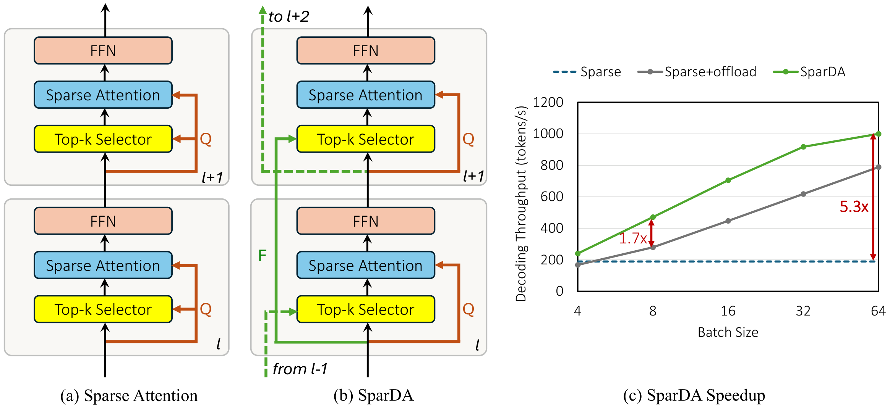

<h1 align="center">SparDA: Sparse Decoupled Attention</h1>

<p align="center">
  <b>Efficient long-context LLM inference with learned lookahead sparse selection</b>
</p>

<p align="center">
  <a href="#overview">Overview</a> |
  <a href="#installation">Installation</a> |
  <a href="#training">Training</a> |
  <a href="#evaluation">Evaluation</a> |
  <a href="https://arxiv.org/abs/2606.04511">arxiv</a>
</p>

## Overview

SparDA is a training and evaluation codebase for "SparDA: Sparse Decoupled
Attention for Efficient Long-Context LLM Inference".

<p align="center">
  
</p>

<p align="center">
  <em>SparDA overview: the Forecast from layer <code>l</code> drives
  top-k selection for layer <code>l+1</code>, while the Query still performs
  sparse attention in layer <code>l</code>. This decouples selection from
  attention and enables one-layer lookahead KV prefetch from CPU.</em>
</p>

The core idea is to decouple sparse block selection from the attention query.
SparDA adds a lightweight per-layer Forecast projection alongside Query, Key,
and Value. The Forecast from layer `l` predicts the KV blocks needed by layer
`l+1`, while the normal attention query still performs attention in layer `l`.
This gives the runtime one layer of lookahead for CPU-to-GPU KV prefetch and
reduces selection overhead by using one Forecast head per GQA group.

Reported SparDA results include:

- adds less than 0.5% parameters to the base model;
- trains only the Forecast/indexer projections while freezing the backbone;
- matches or improves sparse-attention accuracy on MiniCPM4.1-8B and NOSA-8B;
- reaches up to 1.25x prefill speedup and 1.7x decode speedup over sparse
  offload, and up to 5.3x higher decode throughput than non-offload sparse by
  enabling larger feasible batches.

## Repository Layout

```text
sparda/
├── models/
│   ├── minicpm/                 # MiniCPM4.1-8B modeling with SparDA modes
│   └── nosa/                    # NOSA-8B HF/modeling path with SparDA modes
├── training/
│   ├── train_indexer.py         # Unified Forecast/indexer training entrypoint
│   ├── minicpm_data.py          # Dataset loading and retokenization helpers
│   └── run_train.sh             # Local training launcher
├── eval/
│   ├── run_accuracy.sh          # Accuracy sweep launcher
│   ├── run_efficiency.sh        # Efficiency/profile sweep launcher
│   └── collect_results.py       # Result aggregation into workbook/plots
├── infllmv2_cuda_impl/          # CUDA extension for two-stage sparse attention
└── NOSA/                        # NOSA/NOSI inference path and benchmark suites
```

Generated artifacts such as `datasets/`, `checkpoints/`, `results/`, `logs/`,
and `wandb/` are ignored by git.

## Installation

### Shared Docker image

The recommended release path is a single Docker image for both Forecast/indexer
training and NOSA/NOSI evaluation. We do not provide or update a prebuilt
runtime image for users; build your own image from the checked-in Dockerfile
after cloning the repo and initializing CUTLASS:

```bash
git clone <repository-url>
cd sparda
git submodule update --init --recursive infllmv2_cuda_impl/csrc/cutlass

DOCKER_BUILDKIT=1 docker build \
  -f docker/Dockerfile \
  --build-arg CUDA_ARCH_LIST="8.0;9.0" \
  --build-arg FLASH_ATTN_CUDA_ARCHS="80;90" \
  -t sparda:local \
  .
```

`CUDA_ARCH_LIST` sets `TORCH_CUDA_ARCH_LIST` for local PyTorch/CUDA extension
builds. The default covers the validated hardware family (`8.0` for A100, `9.0`
for H100/H200). `FLASH_ATTN_CUDA_ARCHS` controls the upstream FlashAttention
source build, using FlashAttention's integer format (`80`, `90`, `100`, `120`).
Override both for other GPUs, for example `--build-arg CUDA_ARCH_LIST="8.9"`
and `--build-arg FLASH_ATTN_CUDA_ARCHS="89"` for Ada cards.

Run commands from the same image by mounting your checkout:

```bash
docker run --rm --gpus all --ipc=host --network host \
  -v "$(pwd)":/workspace/sparda \
  -v /tmp:/tmp \
  -w /workspace/sparda \
  sparda:local \
  ./training/run_train.sh \
    --model_path openbmb/MiniCPM4.1-8B \
    --seq_len 65536 \
    --steps 2000
```

Use the same `sparda:local` image for evaluation:

```bash
docker run --rm --gpus all --ipc=host --network host \
  -v "$(pwd)":/workspace/sparda \
  -v /tmp:/tmp \
  -w /workspace/sparda \
  sparda:local \
  bash NOSA/benchmarks/Efficiency/bench.sh \
    --model-path openbmb/NOSA-8B \
    --backend nosi \
    -B 4 \
    -L 32K \
    --max-new-tokens 4 \
    --test-n 2 \
    --dataset emozilla/pg19 \
    --dataset-split test
```

The image creates `/venv/sparda` and puts it on `PATH`. Rebuild the image when
dependencies or local CUDA extensions change.

On clusters where Docker's local image cache is node-local, save the built image
to shared storage and load it on later workers instead of rebuilding:

```bash
mkdir -p <shared-path>/docker-images
docker save sparda:local -o <shared-path>/docker-images/sparda-local.tar

# Later, on another worker:
docker load -i <shared-path>/docker-images/sparda-local.tar
```

Run the dataset preparation, training, and evaluation commands below inside the
same `sparda:local` container unless noted otherwise.

## Dataset Preparation

The default training dataset is `prolong-64k`, which expects a prepared
MiniCPM-tokenized Mosaic MDS dataset at `datasets/prolong-64k-minicpm/`.
Prepare it once before launching multi-GPU training.

The preparation step needs enough local disk for the original ProLong-64K
dataset and the MiniCPM-tokenized copy. It also needs Hugging Face access for
the ProLong dataset, the MiniCPM tokenizer, and the Llama-3 tokenizer used to
decode the original ProLong token IDs.

Download and retokenize ProLong:

```bash
huggingface-cli download \
  --repo-type dataset \
  --local-dir datasets/prolong-64k \
  princeton-nlp/prolong-data-64K
```

```bash
python training/utils/retokenize_dataset.py \
  --input_path datasets/prolong-64k \
  --output_path datasets/prolong-64k-minicpm \
  --src_model meta-llama/Meta-Llama-3-8B-Instruct \
  --tgt_model openbmb/MiniCPM4.1-8B \
  --num_workers 16
```

## Training

Train only the SparDA Forecast/indexer projections:

The release launcher supports single-node, multi-GPU training only. Select the
number of local GPU processes with `--gpus N` or `GPUS=N`. Multi-node training
depends on each user's cluster, scheduler, networking, and storage setup; adapt
`training/train_indexer.py` and the Accelerate launch arguments to your own
environment, such as Slurm, when you need multi-node training.

`training/run_train.sh` targets an effective global batch size of 32 by default
and computes `--gradient_accumulation_steps` from `GPUS` and `BATCH_SIZE`.
Override this with `--target-batch-size N` or `TARGET_BATCH_SIZE=N`.
The evaluated setting uses ProLong-64K, BF16 mixed precision, 2,000 optimizer
steps, learning rate `5e-4`, and effective global batch size 32; MiniCPM4.1-8B
is trained at 64K sequence length and NOSA-8B at 32K.

```bash
# MiniCPM4.1-8B, local single-node launch
./training/run_train.sh \
  --model_path openbmb/MiniCPM4.1-8B \
  --seq_len 65536 \
  --steps 2000

# NOSA-8B, local single-node launch
./training/run_train.sh \
  --model_path openbmb/NOSA-8B \
  --seq_len 32768 \
  --steps 2000
```

Optional W&B logging:

```bash
export WANDB_API_KEY=<wandb-api-key>
./training/run_train.sh \
  --model_path openbmb/MiniCPM4.1-8B \
  --enable_wandb
```

Important arguments:

| Argument | Default | Description |
| --- | --- | --- |
| `--model_path` | required | Hugging Face model ID or local model path |
| `--indexer_path` | none | Load Forecast/indexer weights only |
| `--data_path` | `prolong-64k` | `prolong-64k` or a local ProLong-format MDS path |
| `--output_dir` | `checkpoints` | Checkpoint directory |
| `--seq_len` | model max | Training sequence length |
| `--steps` | `2000` | Optimizer steps |
| `--lr` | `5e-4` | Forecast/indexer learning rate |
| `--training_kernel_size` | `2` | Fine KL-teacher kernel used during training |
| `--training_kernel_stride` | `1` | Fine KL-teacher stride used during training |
| `--resume` | false | Resume full training state from latest checkpoint |

## Checkpoints

SparDA checkpoints are not source files and are not included in the release
package. Train Forecast/indexer weights yourself or provide a checkpoint from
your own artifact store:

```text
/path/to/sparda-indexer.pt
```

Pass explicit paths with `--indexer_path` for training and `--indexer-path` for
the benchmark entrypoints. For repo-level sweep helpers, use
`--nosa-sparda-indexer-path` / `--minicpm-sparda-indexer-path` for accuracy and
`--nosa-indexer-path` / `--minicpm-indexer-path` for efficiency.

```bash
--indexer_path /path/to/ckpt.pt
```

Training checkpoints contain Forecast/indexer weights, optimizer state,
training step, `sparse_config`, and `base_model_path`. Loading with
`--indexer_path` restores weights only; `--resume` restores the latest full
training checkpoint from `--output_dir`.

## Evaluation

Benchmark entrypoints live under `NOSA/benchmarks/`. Repo-level sweep helpers
live under `eval/`.

```bash
# RULER
python NOSA/benchmarks/RULER/scripts/run.py \
  --model-path openbmb/NOSA-8B \
  --sparda \
  --indexer-path /path/to/sparda-indexer.pt

# LongBench
python NOSA/benchmarks/LongBench/run.py \
  --model-path openbmb/NOSA-8B \
  --max-length 32768

# HELMET
python NOSA/benchmarks/HELMET/run.py \
  --model-path openbmb/NOSA-8B \
  --sparda \
  --indexer-path /path/to/sparda-indexer.pt \
  --output-dir results/helmet/nosa/sparda

# Reasoning
python NOSA/benchmarks/Reasoning/run.py \
  --model 8b_nosa \
  --model-path openbmb/NOSA-8B

# Efficiency
bash NOSA/benchmarks/Efficiency/bench.sh \
  --model-path openbmb/NOSA-8B \
  --backend nosi \
  --sparda \
  --indexer-path /path/to/sparda-indexer.pt \
  -B 4 \
  -L 64K
```

Sweep helpers:

```bash
# Preview accuracy jobs
bash eval/run_accuracy.sh --dry-run

# Run a small local accuracy sweep
bash eval/run_accuracy.sh \
  --benchmarks ruler \
  --models nosa \
  --configs sparse,sparda \
  --nosa-sparda-indexer-path /path/to/sparda-indexer.pt

# Run a local efficiency sweep
bash eval/run_efficiency.sh \
  --models nosa \
  --configs sparse,sparda,sparda-no-prefetch \
  --seq-lens 32K,64K \
  --batch-sizes 4,8 \
  --nosa-indexer-path /path/to/sparda-indexer.pt

# Aggregate accuracy and efficiency outputs
python eval/collect_results.py
```

## Related Projects

SparDA directly uses benchmark components from
[LongBench](https://github.com/THUDM/LongBench),
[HELMET](https://github.com/princeton-nlp/HELMET),
[RULER](https://github.com/NVIDIA/RULER), and
[NOSA](https://github.com/thunlp/NOSA). The inference pipeline is built
on the NOSA/NOSI code path, and the sparse-attention CUDA path builds on ideas
and infrastructure from
[InfLLM-V2](https://github.com/OpenBMB/infllmv2_cuda_impl) and
[InfiniGen](https://github.com/snu-comparch/InfiniGen).

## Contributions

This project is currently not accepting contributions.

## License

See [LICENSE](LICENSE) for the Apache-2.0 project license, third-party OSS
licenses, and third-party attributions.
